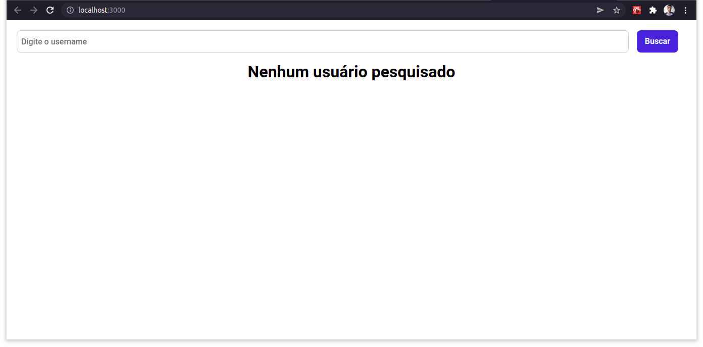
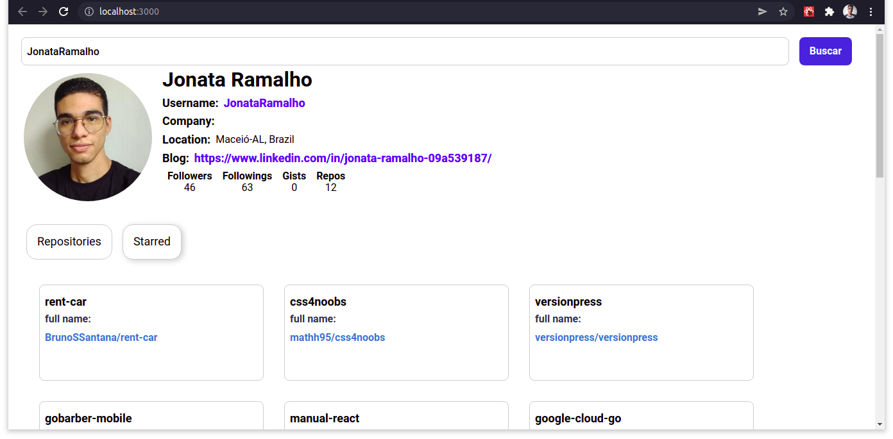

<h1 align="center">
    GitHub API Interface
</h1>

<br/>

> Este projeto é uma aplicação frontend para realizar pesquisas de usuários do github e apresentar as informações do perfil. Objetivo principal é treinar a utilização de componentes reutilizáveis no React.

---

<br/>

# :pushpin: Índice

<p align="left">
    <ul>
        <li><a href="#rocket-tecnologias">Tecnologias</a></li>
        <li><a href="#information_source-como-usar">Como usar</a></li>
        <li><a href="#iphone-layout">Layout</a></li>
    </ul>
    
</p>

<br/>
<br/>

# :rocket: Tecnologias

- React
- Styled Components
- Context API
- Axios
- react-tabs
- API REST do GitHub

<br/>

# :information_source: Como usar

```bash
# Clone este repositório:
$ git clone https://github.com/JonataRamalho/github-api.git

# Vá para o repositório:
$ cd github-api

# Instale as dependências:
$ yarn install

# Inicie o React:
$ yarn start
```

<br/>

# :iphone: Layout

<h1 align="center">
    &nbsp;&nbsp;&nbsp;
    &nbsp;&nbsp;&nbsp;
    
</h1>

Feito por [Jonata Ramalho](https://github.com/JonataRamalho) ⚡️
